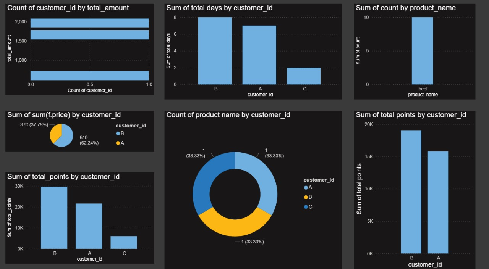

# 🍽️ Kacchi.com Customer & Sales Data Analysis  
This project dives into customer behavior, spending trends, and loyalty program performance using **SQL** for data analysis and **Power BI** for interactive visualization.  
goal? **Help Kacchi.com make smarter, data-driven decisions** to improve sales and customer engagement.  

---

##  Project Overview  

This repository contains:  
✅ **SQL Scripts** – to clean, transform, and analyze raw sales, menu, and membership data  
✅ **ETL Workflow** – extracting, structuring, and loading data into a relational database  
✅ **Interactive Power BI Dashboard** – visualizing key business metrics and customer insights  

Together, they provide a complete **end-to-end data analytics solution** for a restaurant business scenario.  

##  Tools & Technologies  

| Tool / Tech      | Purpose |
|------------------|---------|
| **MySQL Workbench / DBeaver** | Database creation, data import, query execution |
| **SQL**          | Answering business questions, data exploration |
| **ETL Concepts** | Cleaning & structuring data for analysis |
| **Power BI**     | Building an interactive dashboard for insights |

## 🗂Data Model  

The project is based on three core tables:  
- **sales** – contains all customer orders with dates & product IDs  
- **menu** – product details including names and prices  
- **members** – customer join dates for the loyalty program  

## Business Questions Answered  

-  **How much did each customer spend in total?**  
-  **How often did each customer visit the restaurant?**  
-  **What was the first item purchased by each customer?**  
-  **What is the most purchased menu item overall and per customer?**  
-  **How did the loyalty program affect customer behavior?**  
-  **How many points did each customer earn (including multipliers)?**

> You can find all SQL queries in the `SQL` folder, each well-commented for clarity.

## 📊 Dashboard Preview  

Here’s a sneak peek at the **Power BI Dashboard** used in this project:  

